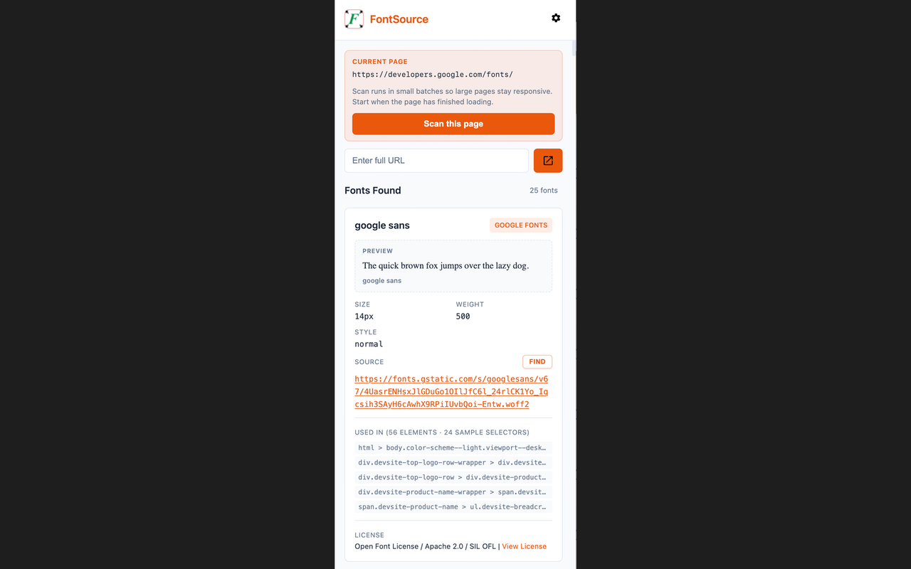

# FontSource - Browser Extension



A browser extension that analyzes websites to identify fonts, their sources, and license information.

Safari ships through a small tracked macOS host app under `safari/`, while Chrome and Firefox ship from the web-extension sources in `src/`.

## Features

- Detects fonts used on any website
- Identifies font sources (Google Fonts, Adobe Typekit, self-hosted, etc.)
- Shows license information for each font
- Configurable scanning options (root vs current page)
- Clean, modern UI with detailed font information

## Supported Browsers

- Chrome
- Firefox
- Safari

## Quick Start

```bash
# Install dependencies
make install

# Build the extension
make build         # All browsers
make build-chrome  # Chrome
make build-firefox # Firefox
make build-safari  # Safari

# Load in browser
make load-chrome    # Chrome
make load-firefox   # Firefox
make load-safari    # Safari

# Run tests
make test

# Package for distribution
make package-chrome
make package-firefox
make package-safari  # Safari web-extension source archive only
```

## Makefile Commands

### Installation & Build
| Command | Description |
|---------|-------------|
| `make install` | Install npm dependencies |
| `make build` | Build all browser targets under `artifacts/` |
| `make build-chrome` | Build for Chrome (`manifest.json` in `artifacts/chrome/`) |
| `make build-firefox` | Build for Firefox (MV2 manifest in `artifacts/firefox/`; required for temporary add-on) |
| `make build-safari` | Build Safari web-extension resources (`manifest.json` in `artifacts/safari/`) |
| `make clean` | Remove `artifacts/` (unpacked extension and store zips); keeps `node_modules` |

### Development
| Command | Description |
|---------|-------------|
| `make lint` | Lint JavaScript code |
| `make format` | Format code with Prettier |
| `make watch` | Watch for file changes |

### Loading in Browser
| Command | Description |
|---------|-------------|
| `make load-chrome` | Load extension in Chrome (development) |
| `make load-firefox` | Load extension in Firefox (development) |
| `make load-safari` | Load extension in Safari (development) |

### Uninstalling from Browser
| Command | Description |
|---------|-------------|
| `make uninstall-chrome` | Uninstall from Chrome |
| `make uninstall-firefox` | Uninstall from Firefox |
| `make uninstall-safari` | Uninstall from Safari |

### Packaging
| Command | Description |
|---------|-------------|
| `make package-chrome` | Create Chrome Web Store package |
| `make package-firefox` | Create Firefox Add-ons package |
| `make package-safari` | Create the Safari web-extension source archive |
| `make package` | Create packages for all platforms |

### Deployment
| Command | Description |
|---------|-------------|
| `make deploy-chrome` | Deploy to Chrome Web Store |
| `make deploy-firefox` | Deploy to Firefox Add-ons |
| `make deploy-safari` | Print Safari packaging reminders |
| `make deploy` | Deploy to all stores |

### Help
| Command | Description |
|---------|-------------|
| `make help` | Show all available commands |
| `make` | Show help (default target) |

## Project Structure

```
FontSource/
├── artifacts/                 # make build / package-* output (gitignored)
│   ├── chrome/                # unpacked Chrome extension
│   ├── firefox/               # unpacked Firefox extension
│   ├── safari/                # unpacked Safari web-extension resources
│   └── fontsource-*.zip       # store/upload archives
├── src/
│   ├── background.js          # Background service worker
│   ├── content.js             # Content script for font detection
│   ├── popup/                 # Popup UI
│   │   ├── popup.html
│   │   ├── popup.css
│   │   └── popup.js
│   ├── settings/              # Settings panel
│   │   ├── settings.html
│   │   ├── settings.css
│   │   └── settings.js
│   └── lib/                   # Utility libraries
│       └── font-detection.js
├── safari/                    # tracked macOS Safari host app + extension wrapper
├── src/manifest.json          # Chrome manifest
├── src/manifest.firefox.json  # Firefox manifest
├── src/manifest.safari.json   # Safari manifest
├── package.json               # npm package config
├── Makefile                   # Build and deployment commands
├── .gitignore
├── .eslintrc.json
└── .prettierrc.json
```

## Release Automation

- Chrome GitHub Actions publish is ready once `CHROME_EXTENSION_ID`, `CHROME_CLIENT_ID`, `CHROME_CLIENT_SECRET`, and `CHROME_REFRESH_TOKEN` are added as repository secrets.
- Firefox GitHub Actions publish is ready once `WEB_EXT_API_KEY` and `WEB_EXT_API_SECRET` are added as repository secrets.
- Safari GitHub Actions uses the tracked `safari/FontSource.xcodeproj` wrapper on `macos-latest`, archives a signed macOS app, exports a `.pkg`, and uploads it to App Store Connect.
- Safari requires Apple signing and upload secrets. See `env.example` for the current secret names.

## Safari Notes

- The Safari Xcode project is safe to keep in git. User state, certificates, private keys, provisioning profiles, and generated extension resources stay ignored.
- The Xcode wrapper reads extension files from `src/` at build time, so there is no second source tree to maintain under `safari/`.
- `make package-safari` only creates the Safari web-extension source archive. The Mac App Store release path goes through the Xcode project and GitHub Actions Safari job.

## Development

```bash
# Watch mode for development
make watch

# Lint code
make lint

# Format code
make format
```

## License

MIT License
